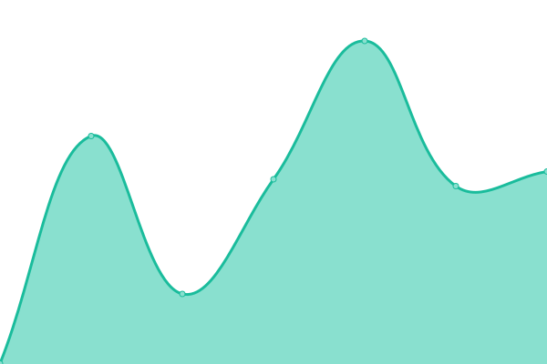

# [📈 Live Status](https://status.shakedown.social): <!--live status--> **🟩 All systems operational**

This repository contains the open-source uptime monitor and status page for [Clif Reeder](https://clifff.com), powered by [Upptime](https://github.com/upptime/upptime).

With [Upptime](https://upptime.js.org), you can get your own unlimited and free uptime monitor and status page, powered entirely by a GitHub repository. We use [Issues](https://github.com/clifff/upptime/issues) as incident reports, [Actions](https://github.com/clifff/upptime/actions) as uptime monitors, and [Pages](https://status.shakedown.social) for the status page.

<!--start: status pages-->
<!-- This summary is generated by Upptime (https://github.com/upptime/upptime) -->
<!-- Do not edit this manually, your changes will be overwritten -->
<!-- prettier-ignore -->
| URL | Status | History | Response Time | Uptime |
| --- | ------ | ------- | ------------- | ------ |
|  [Shakedown Social](https://shakedown.social) | 🟩 Up | [shakedown-social.yml](https://github.com/shakedown-social/upptime/commits/HEAD/history/shakedown-social.yml) | 

 427ms
     
 | 

<a href="https://status.shakedown.social/history/shakedown-social">100.00%</a>
    

|  [Shakedown Social - Streaming](https://shakedown.social/api/v1/streaming/health) | 🟩 Up | [shakedown-social-streaming.yml](https://github.com/shakedown-social/upptime/commits/HEAD/history/shakedown-social-streaming.yml) | 

 45ms
     
 | 

<a href="https://status.shakedown.social/history/shakedown-social-streaming">100.00%</a>
    

|  [Shakedown Social - Files](https://files.shakedown.social/accounts/avatars/109/357/389/718/265/462/original/dd80d2c95e48cfd2.jpeg) | 🟩 Up | [shakedown-social-files.yml](https://github.com/shakedown-social/upptime/commits/HEAD/history/shakedown-social-files.yml) | 

 118ms
     
 | 

<a href="https://status.shakedown.social/history/shakedown-social-files">100.00%</a>
    

<!--end: status pages-->

[**Visit our status website →**](https://status.shakedown.social)

## 📄 License

- Powered by: [Upptime](https://github.com/upptime/upptime)
- Code: [MIT](./LICENSE) © [Clif Reeder](https://clifff.com)
- Data in the `./history` directory: [Open Database License](https://opendatacommons.org/licenses/odbl/1-0/)
